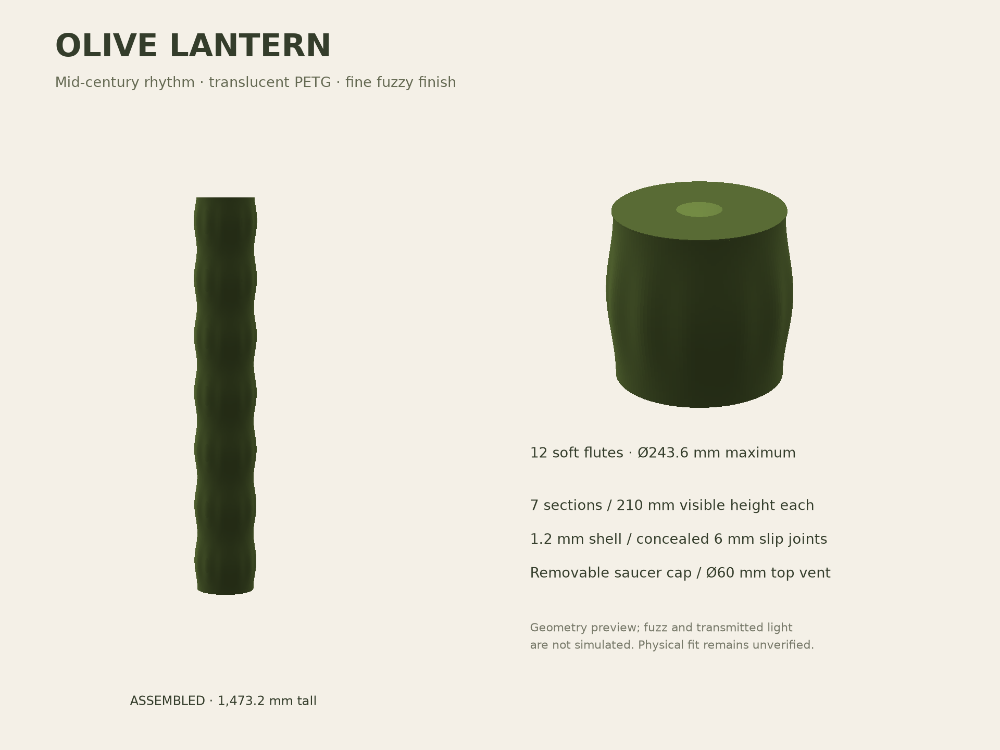

# Olive Lantern

A mid-century modern floor-lamp sleeve: seven softly rounded sections, twelve
shallow vertical flutes, and a fine pebbled olive finish. The repeated forms
reference stacked ceramic lamps and paper lanterns. A removable, beveled saucer
cap finishes the top while leaving a central ventilation opening. Translucent PETG and fuzzy
skin should soften the LEDs; actual diffusion and color need a print trial.



**Prototype status:** printable meshes are supplied, but physical fit, heat,
stability, and diffusion have not been tested. The full-height sleeve is the
initial design assumption; dimensions are based on the online sources below.

## Lamp and fit

The [linked Amazon listing](https://www.amazon.com/dp/B0BLSGHRXB?th=1) identifies
a Govee H6076 RGBIC floor lamp, with nominal dimensions 7.9 × 7.9 × 53.7 inches
(200.7 × 200.7 × 1364 mm). This is a freestanding sleeve around that lamp, with
its own bottom edge resting on the floor. There is no socket fitting, pole
clamp, or load on the LED column. Govee's [H6076 manual](https://m.media-amazon.com/images/I/B1zVyXg1UkL.pdf)
shows a cable leaving the base, followed by an inline controller and separate
power adapter. The rear arch admits the cable from below, so neither the
controller nor the adapter needs to pass through it. Their dimensions therefore
do not constrain the shade's diameter. The manual does not dimension the cable
exit or strain relief; the arch is a design allowance, not a measured fit.

An [H6076 product information sheet](https://maxelektro.pl/storage/file/pimcore_import/2023/10/6/c3b5da00f8b2dd766408e5ee16213a8f/lampa-led-govee-h6076-karta-informacyjna-produktu.pdf)
also reports 200 × 200 × 1410 mm. Rather than assume these listings describe
identical revisions, the shade covers the taller published envelope too, with
60 mm of headroom. For the exact linked 53.7-inch silver variant, headroom is
about 106 mm. Sources researched September 12, 2026.

| Dimension | Design |
| --- | --- |
| Assembled height | 1473.2 mm with cap; 1470 mm without |
| Maximum diameter | 243.6 mm, before fuzz |
| Visible section height | 210 mm |
| Base / middle print height | 216 mm, including collar |
| Top print height | 210 mm, no protruding collar |
| Separate cap | Ø224 × 9.2 mm in print orientation; adds 3.2 mm when seated |
| Cap vent / roof | Ø60 mm central opening / 1.6 mm roof |
| Shell thickness | 1.2 mm radial; approximately three extrusion lines |
| Bottom opening diameter | 217.6 mm |
| Minimum passage diameter, inside collars | 214.5 mm |
| Male collar outside diameter | 216.9 mm |
| Joint clearance | 0.70 mm diametral / 0.35 mm radial |
| Collar engagement | 6 mm |
| Rear cable arch | 10 mm high, approximately 21 mm wide at floor; 8 mm flat crown |

The 214.5 mm minimum passage gives approximately 6.9 mm radial clearance
around the linked nominal 200.7 mm base when centered. The shade is located
concentrically around that base, not around the off-center column. Use the short
fit ring to verify the as-printed clearance before making seven large parts.
Keep the inline controller and adapter outside the shade, with the flexible
cord laid through the open-bottom arch. If the cable exit prevents the bottom
rim from sitting flat, enlarge the arch parameter before printing the full set;
do not trap or sharply bend the cord.

## Files and print quantities

| STL | Quantity | Purpose |
| --- | --- | --- |
| [fit_male.stl](models/fit_male.stl) | 1 first | Short ring with the actual minimum bore and male collar |
| [fit_female.stl](models/fit_female.stl) | 1 first | Mating clearance check |
| [base.stl](models/base.stl) | 1 | Bottom section with rear cable arch |
| [middle.stl](models/middle.stl) | 5 | Repeated section with top collar |
| [top.stl](models/top.stl) | 1 | Uppermost shade section; receives the cap |
| [cap.stl](models/cap.stl) | 1 | Removable beveled lid with central vent |

Print the rings separately, upright, with no fuzz. Confirm that the female ring
seats on the male shoulder by hand without force and that the male ring clears
the lamp. These simplified rings test nominal joint diameters; the complete
base and one middle section are the next assembly test. Full-size female
openings flare slightly above their bottom edge.

The seven shells contain about 1.30 liters of plastic, roughly **1.7 kg of
PETG** using 1.27 g/cm³ as an estimate, before brims, calibration, and test rings.
Plan for two 1 kg spools; use the slicer's estimate for purchasing and scheduling.
The separate cap adds approximately 85 g before brim and slicer adjustments.

## Top cap

Print [cap.stl](models/cap.stl) **as supplied, broad exterior face on the plate
and locating collar pointing up**. Use the same PETG, 0.20 mm layers, 3 walls,
3 top/bottom layers, and a 3 mm brim. For this part use **100% infill** so the
1.6 mm roof is solid throughout. Supports and vase mode stay off. Its flat
annular face sits on the bed and the beveled edge narrows upward; there is no
large unsupported roof to bridge.

Keep fuzzy skin **off on the cap** for the first print. Its visible flat face
takes the build plate's finish; fuzzy skin does not texture this horizontal
face. A textured plate gives it a complementary texture. The locating collar
and seating annulus must remain smooth for fit.

After printing, flip it over and lower its collar into the existing top section.
It uses the same 0.35 mm radial clearance and 6 mm engagement as the test rings.
The cap is removable and needs no glue; it covers about 92% of the original
opening, leaving a Ø60 mm central vent (approximately 28 cm²). Keep that vent
clear. This opening is a ventilation provision, not verified thermal performance:
repeat the attended lighting trial with the cap fitted. Remove it if heat builds
up. The original upper shade section and other previously generated parts are
compatible without modification.

## Bambu Studio setup

These are proposed starting settings, not a physically qualified print profile.
STLs contain geometry only; they do not contain fuzzy skin or printer settings.

1. Select **Bambu Lab P2S, 0.4 mm nozzle**, and **Bambu PETG Translucent**. Use
   the filament profile's temperatures, cooling, and volumetric flow limit.
   The locally installed Studio 2.8.2.61 P2S preset specifies 250°C first layer,
   245°C subsequent layers, and 6 mm³/s maximum volumetric speed. Keep the
   selected plate's matching bed preset and prepare it for PETG. Dry the spool
   according to Bambu's current material instructions.
2. Begin with 0.20 mm layers, **3 wall loops**, **0% sparse infill**, and 3 top /
   bottom shell layers. The modeled center stays open; top and bottom layers
   only close the thin material rims and shoulder. Keep vase mode **off**.
   Use Arachne wall generation if the fixed-width preview leaves shell gaps.
3. Place **one section per plate**, upright as supplied, at 100% scale. Use a
   3 mm outer brim, supports off, outer wall speed around 40 mm/s, and align
   the seam toward the rear cable opening. Inspect the cable arch's short crown
   bridge on the base trial. Enable neither a prime tower nor smooth timelapse
   features that reserve space or cause unnecessary travel.
4. Set **Fuzzy skin: Contour**, thickness **0.15 mm**, point distance **0.40 mm**.
   Keep **Z=0–14 mm and Z=204 mm to the part top smooth** using height-range
   settings with fuzzy skin disabled. Alternatively paint only the outside
   between those heights in Studio's fuzzy-skin painting tool. The upper smooth
   range includes the collar and shoulder. The bottom smooth range preserves
   the cable arch, first layers, and receiving rim. Use no fuzz on either test
   ring. Inspect the sliced preview to confirm that the inner walls and mating
   surfaces are smooth, especially around the arch.
5. Inspect all layers for a continuous shell, preserved collar, open center,
   and plate clearance before sending a job. A nominal 3 mm brim plus 0.15 mm
   fuzz stays within a 256 mm square, but the selected printer's exclusions,
   purge lines, and slicer placement still need checking.

Print the base first to assess the actual material's light transmission and
texture before making the other six pieces. Fuzzy skin scatters light and may
make the olive look more opaque. Try a warm white lamp setting first; tinted
plastic will alter the apparent RGB colors. For a coarser finish, trial 0.20 mm
thickness and 0.50 mm point spacing on a small sample before changing the set.

## Assembly

Turn off and unplug the lamp. Lower the base section over the column and seat
it on a hard, level floor around the lamp base, with the cable arch at the rear.
Route the cord through the arch without pinching; reconnect only once clearance
is checked. Lower the five middle sections individually over the column, then
the top section. Each receiving rim rests on the previous shoulder; rotate the
flutes and rear seams into alignment. Flip the separately printed cap collar-down
and seat it in the top section; leave the central vent unobstructed.

The slip joints locate the sections but **do not lock them together**. Check
the stack for rocking and use removable clear tape bridging the outside of
each joint for the initial trial. Keep it where it cannot be bumped, and move
it by dismantling it, not by lifting the top. A narrow, tall freestanding shade
needs an actual stability check before regular use; if the intended location
is exposed to knocks, add a measured base restraint before installing it there.

For the first lighting trial, run the actual LED lamp at its brightest intended
setting while attended. Confirm there is an air gap around the column, the cord
is free, and the shade does not soften, distort, or develop a hot spot as it
warms up. PETG temperature resistance is not proof that this assembly is safe.
This design is for the linked LED column, not incandescent or halogen lamps.

## Regeneration and validation

From the repository root:

```bash
python3 projects/01-olive-lantern/src/generate.py
# Optional geometry illustration; requires numpy and matplotlib:
python3 projects/01-olive-lantern/src/preview.py
```

Edit `Parameters` in [src/generate.py](src/generate.py) to change the neck,
wall, flutes, or clearances, then regenerate all parts together. Dimensions in
this README describe the defaults. The height / vertical-step ratio is
constrained to 2 mm to retain the modeled collar taper. Changing the number of
sections affects the preview and required quantity, not the individual STL.

The generator checks nondegenerate triangles, two faces per edge, consistent
winding, positive enclosed material volume, and nominal P2S bounds. Results
are in [docs/mesh-report.json](docs/mesh-report.json). The slicer trial and its
limitations are in [docs/validation.md](docs/validation.md). These checks do not prove
physical fit, stability, thermal performance, or successful printing.

## References

- [Lamp listing](https://www.amazon.com/dp/B0BLSGHRXB?th=1): lamp identification and nominal envelope.
- [Govee H6076](https://us.govee.com/products/govee-rgbicw-smart-corner-floor-lamp): manufacturer's lamp page.
- [P2S manufacturer announcement](https://blog.bambulab.com/the-icon-redefined-meet-the-p2s-a-completely-reengineered-version-of-the-ultra-productive-p1-series/): 256 × 256 × 256 mm build volume.
- [Bambu PETG Translucent](https://us.store.bambulab.com/products/petg-translucent?id=42479468281992): translucent material and Olive color, #748C45.
- Bambu Studio 2.8.2.61 installed BBL profiles: P2S 0.4 mm PETG Translucent temperature and flow settings. The fuzzy values above are design recommendations.
