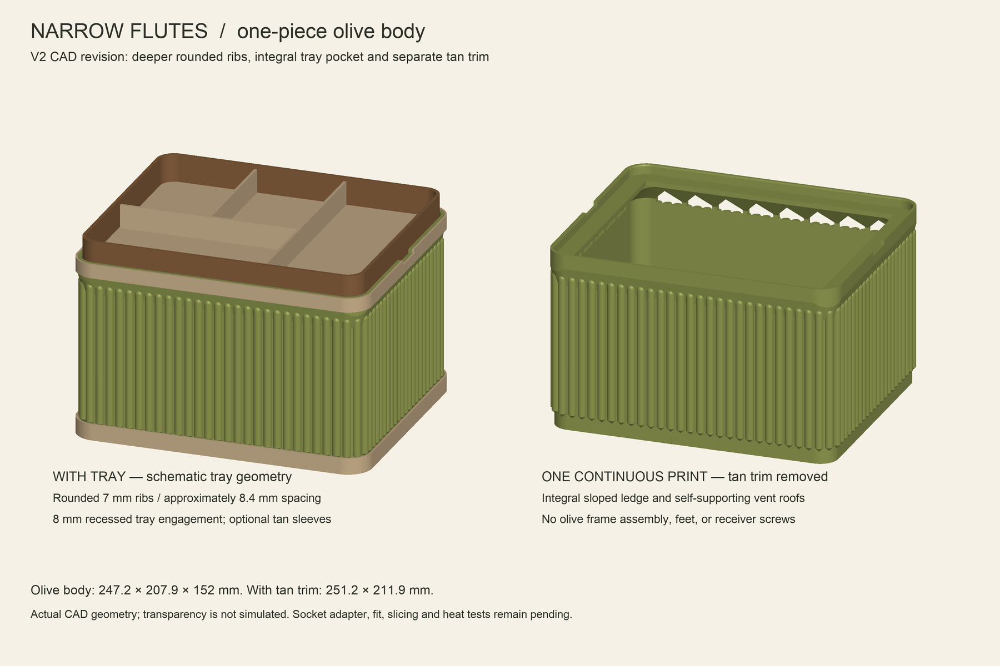

# Narrow Flutes Tray Lamp — V2

A Bauhaus-inspired, translucent olive PETG lamp with a snug recessed receiver
for an unmodified Nordik leather valet tray. The olive body, tray ledge and lower
frame print as one connected part; desert tan PLA trim prints separately.
One horizontal Govee H6008 A19/E26 bulb is reserved inside the body.

**Mechanical prototype:** the socket adapter and strain relief are unfinished.
Tray fit, slicing, support-free printing, strength and heat behavior have not
been physically validated. Print the fit samples before the full body.



## Downloads

| Part | Material | Purpose |
| --- | --- | --- |
| [Corner coupon](models/tray_corner_coupon.stl) | PETG | First check of the assumed tray corner |
| [Complete fit-test rim](models/tray_fit_test_rim.stl) | PETG | Confirm full length, width and grip-pad fit |
| [One-piece olive body](models/olive_body_one_piece_PETG.stl) | Translucent olive PETG | Integral diffuser, frame and tray receiver |
| [Base trim](models/tan_base_trim_PLA.stl) | Desert tan PLA | Separate cosmetic sleeve |
| [Top trim](models/tan_top_trim_PLA.stl) | Desert tan PLA | Separate cosmetic sleeve |

STLs use millimeters and are placed flat/upright with minimum Z at zero.
The body uses ordinary printing mode, not vase mode. Sloped ledge supports and
45-degree vent roofs are intended to avoid trapped supports, but a connected
mesh is not proof of a successful support-free print. No verified P2S 3MF or
G-code is included.

## Dimensions and fit

| Feature | Dimension |
| --- | --- |
| Provided tray | 240.03 × 200.66 × 25.40 mm; 371.4 g before contents |
| Olive body | 247.23 × 207.86 × 152 mm |
| Footprint with tan trim | 251.23 × 211.86 mm |
| Tray pocket | 241.23 × 201.86 mm; 8 mm deep |
| Rigid clearance | 0.6 mm per side; adjustable compressible grip pads |
| Height with inserted tray | 169.4 mm |
| Rib profile | Rounded 7 mm-wide ribs, ~8.4 mm pitch, 3.4 mm relief |

The tray corner radius is a **15 mm assumption**, not a measurement. Confirm it
with the corner coupon, then test the complete rim. The tray lifts out deliberately;
the receiver restricts sideways movement without a positive upward latch.

The 251.23 mm-wide trim leaves only about 2.38 mm per edge on the P2S's nominal
256 mm build area. Check plate placement and brim width in Bambu Studio.

## Regenerate

Tested with Python 3.12 and the versions in [requirements.txt](requirements.txt).
From this project directory:

```sh
python -m venv .venv
source .venv/bin/activate
python -m pip install -r requirements.txt
python src/generate.py
```

Edit [parameters.json](parameters.json) before regenerating. The script writes
the meshes to `models/`, validation to `docs/`, and the CAD preview to `previews/`.
Fonts fall back to a bundled Pillow font if Arial or DejaVu Sans is unavailable.
Some rib geometry, vent positions and mounting features remain fixed prototype
values in the source; review those when changing major dimensions.

To reproduce the optional geometric overhang screening (also regenerates the
models and preview):

```sh
python src/screen_overhang.py
```

## Validation and remaining work

[Mesh report](docs/validation.json): all five designs are single connected,
watertight, consistently wound solids within the nominal 256 mm build envelope.
Tan sleeves do not overlap the olive body. Reserved bulb/socket envelopes do not
intersect the body. Exported STL files were reloaded and checked for watertightness
and exactly two incident faces per edge.

[Overhang screening](docs/overhang-screen.json) compares 0.2 mm-spaced horizontal
sections with the prior section expanded by 0.25 mm. It identifies small local
overhangs; it is **not** toolpath generation or slicer validation.

Before the complete lamp is used:

1. Confirm tray corner, pocket and grip-pad fit with the samples.
2. Select a complete prewired E26 socket/cord assembly and design its adapter,
   retention and strain relief. The current 45 × 45 mm socket allowance is provisional.
3. Inspect and slice the full body in Bambu Studio; verify bridges and print settings.
4. Test the printed receiver with the tray and intended contents, then validate
   temperatures with the chosen bulb and the tray installed.

The H6008 label prohibits totally enclosed luminaires. V2 has intake and exhaust
windows on the rear and left end; acceptable temperatures have not been established.
This incomplete prototype should not be energized before hardware is finalized.

See [detailed design notes](docs/design-notes.txt) for mounting-pad geometry,
materials, fit tests and assembly limitations. The tray in the preview is schematic;
PETG transparency and glow are not simulated.

## References

- [Nordik tray](https://www.amazon.com/dp/B0C9CFWXQK)
- [Govee bulb](https://www.amazon.com/dp/B09B7NQT2K)
- [Manufacturer bulb label](https://fcc.report/FCC-ID/2AQA6-H6008/5384919.pdf)

This project was designed independently and does not include models from the
repository's TriLamp project.
